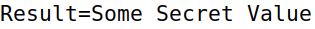

# Spectre Attack Lab

## Task 1: Reading from Cache

By compiling and running the CacheTime.c program it is possible to notice that the access time for array three and seven is in general considerably faster than the others. In particular, by running the program multiple times, the two arrays mantain an average cpu cycle value around 300 to 500.

## Task 2: Using Cache as a Side Channel

In my case, running the program with threshold equals to 80 takes about 40 runs to find the secret (that is array[94*4096 + 1024]). Looking at the results obtained in Task1, it is clear that the value are quite swinging, anyway, by adjusting the threshold to a value of 150 takes about ten runs to find the secret.

## Task 3: Out-of-Order Execution and Branch Prediction

After adjusting the threshold and running the program couple of times we can see that the *array[97*4096+DELTA]* is in the cache so line [2] is exectued successfully exploiting the out-of-order execution.
By commenting the line where the value of size is flushed, we let it stay into the cache, so we are not going to let cpu predict the outcome of the comparsion. Hence, in this case, out-of-order exection is not exploited and therefore we don't get the secret.

Then, by repleacing victim(i) with victim(i+20) the cpu is supposed to be trained to take the false branch inside victim() so the code inside won't be executed because cpu is not going to try to predict the outcome of taking the true branch.

## Task 4: The Spectre Attack

It is possibile to see, after multiple runs of the program, that we can obtain the secret (83) which stands for 'S' and it is the first byte of the secret string. Altough tere is lot of noise in the channel, with sever exectuion we can see the other bytes of the string just repeating the program increasing the index_beyond value.

## Task 5

It is possibile to fix the code by setting *scores[0]* to 0 before the iteration for the max searching. It's likely to be the most hit because when we access a cell outisde the buffer the sandbox function returns 0. Furthermore the sleep duration affects the number of hits of the secret value even if the results are not that steady. A value such as 1000 microseconds, most of times, decreases the number of hits of the secret value. Meanwhile, keeping the value between 0 and 100 doesn't change the avarege number of hits.

## Task 6

The following code prints out the complete secret string (the rest of the code is the same of *SpectreAttackImproved.c* plus the inclusion of the *string.h* library).

```c
int main() {
    int i;
    uint8_t s;
    size_t index_beyond = (size_t)(secret - (char*)buffer);
    char result[strlen(secret)];

    for(int j=0; j<strlen(secret); j++){
        flushSideChannel();
        for(i=0;i<256; i++) scores[i]=0;
        for (i = 0; i<1000; i++) {
            printf("*****\n");
            spectreAttack(index_beyond+j);
            usleep(10);
            reloadSideChannelImproved();
        }
        scores[0]=0;
        int max = 0;
        for (i = 0; i < 256; i++){
            if(scores[max] < scores[i]) max = i;
        }
        result[j]=max;
    }
    printf("Result=%s\n",result);
    return (0);
}
```


