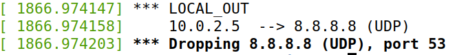
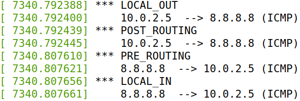
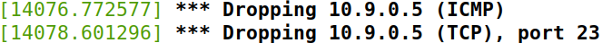
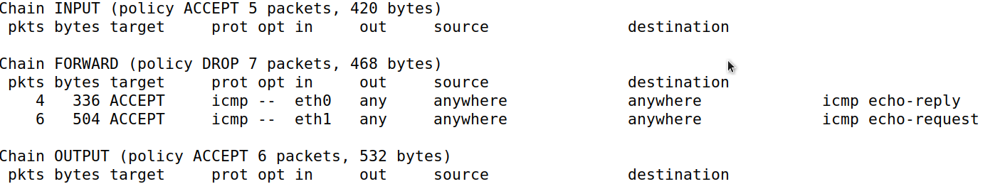
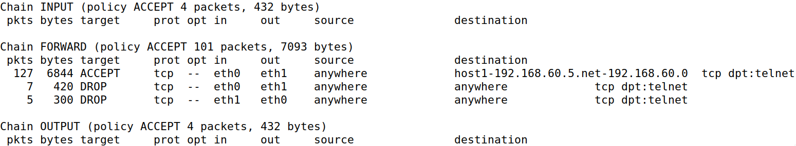

# Firewall Lab - Alex Baron

## Task B: Implement a Simple Firewall Using *Netfilter*

### Task 1B-1

After compiling the code and loading it into the kernel, with the help of *dig*, it is possibile to see with *dmesg* command that the kernel drops the udp packets heading to 8.8.8.8 and port 53.

Thus, the request is blocked and no response is received.



### Task 1B-2

The five netfilter hooks represent different point in the network stack and they are triggered accordingly to the point that the packetes have reached. The first point that a packet encounters is the NF_INET_PRE_ROUTING and it will be triggered by any incoming traffic after entering the network stack and in the same way the NF_INET_POST_ROUTING for the outbound traffic. These hooks are triggered respectively before and after the routing decisions.

NF_INET_LOCAL_IN and NF_INET_LOCAL_OUT work in the same way but post and before routing decisions, respectively. Meanwhile, NF_INET_FORWARD hook is triggered if the packet is to be forwarded to another host.

Our program, after adding the rest of the hooks and loaded into the kernel will print the information for each hook that is triggered accordingly to the passage of a packet in the point where that trigger resides. Thus, with a ping to 8.8.8.8, for instance, it is possibile to see that four hooks have been triggered (see the following image) meanwhile the NF_INET_FORWARD trigger has not, accordingly to the statements above.



### Task 1B-3

In this case two functions are required, and both of them will be assigned to the NF_IP_LOCAL_IN to monitor the incoming ping and telenet connection.

- **Block Pings**: packets that are directed to the VM address (10.9.0.1) and with protocol ICMP will be dropped.
- **Block Telnet Connections**: TCP packets that are addressed to the local VM in port 23 will be dropped.

After loading the module into the kernel it is possibile to notice that when the host 10.9.0.5 tries to ping or to connect via telent to the VM both actions are impossibile to accomplish.



The code of the two functions is the following:

```c
unsigned int block_ping(void *priv, struct sk_buff *skb,
                       const struct nf_hook_state *state)
{
   struct iphdr *iph;

   char ip[16] = "10.9.0.1";
   u32 ip_addr;

   if(!skb) return NF_ACCEPT;

   iph = ip_hdr(skb);
   in4_pton(ip, -1, (u8 *)&ip_addr, '\0', NULL);

   if(iph->protocol == IPPROTO_ICMP && iph->daddr == ip_addr){
       printk(KERN_WARNING "*** Dropping %pI4 (ICMP)\n", &(iph->saddr));
       return NF_DROP;
   }
   return NF_ACCEPT;
}

unsigned int block_telnet(void *priv, struct sk_buff *skb,
                       const struct nf_hook_state *state)
{
   struct iphdr *iph;
   struct tcphdr *tcph;

   u16 port = 23;
   char ip[16] = "10.9.0.1";
   u32 ip_addr;

   if(!skb) return NF_ACCEPT;

   iph = ip_hdr(skb);
   in4_pton(ip, -1, (u8 *)&ip_addr, '\0', NULL);

   if(iph->protocol == IPPROTO_TCP){
      tcph = tcp_hdr(skb);
      if(iph->daddr == ip_addr && ntohs(tcph->dest) == port){
         printk(KERN_WARNING "*** Dropping %pI4 (TCP), port %d\n", &(iph->saddr),port);
      return NF_DROP; 
      }
   }

   return NF_ACCEPT;
}
```

## Task 2: Experimenting with Stateless Firewall Rules

### Task 2A: Protecting the router

- **iptables -A INPUT -p icmp --icmp-type echo-request -j ACCEPT** </br>
**iptables -A OUTPUT -p icmp --icmp-type echo-reply -j ACCEPT** </br>
With these two first commands, we are allowing icmp requests (icmptype 8) in the INPUT chain and also icmp reply (icmptype 0) ini the OUTPUT chain, both in the filter table.

- **iptables -P INPUT DROP** </br>
**iptables -P OUTPUT DROP** </br>
In this case we are setting the policy for INPUT and OUTPUT chains in the filter table to dropping packets.

After adding these rules it is possible to see that we can actually ping the router and get a reply but we cannot establish a telnet connection and this is consistent with the above rules.

### Task 2B: Protecting the Internal Network

The correct configuration is obtained with the following commands:

> iptables -A FORWARD -i eth0 -p icmp --icmp-type echo-reply -j ACCEPT
</br>
> iptables -A FORWARD -i eth1 -p icmp --icmp-type echo-request -j ACCEPT
</br>
> iptables -P FORWARD DROP

In this way the router drops all icmp packets from outside except for the icmp reply that are needed to complete the ping from the inside network to the outside network which is allowed too (icmp request). All the other packets are dropped in the FORWARD chain. The resulting *filter* table is the following:



## Task 2C: Protecting Internal Server

With the following configuration outside hosts can only access telnet server on 192.168.60.5 but no other internal servers. Furthermore internal hosts can access internal servers but cannot access external servers.

> iptables -A FORWARD -i eth0 -o eth1 -p tcp --destination 192.168.60.5 --dport 23 -j ACCEPT
</br>
> iptables -A FORWARD -i eth0 -o eth1 -p tcp --dport 23 -j DROP
</br>
> iptables -A FORWARD -i eth1 -o eth0 -p tcp --dport 23 -j DROP

With eth0 external network and eth1 internal network.


